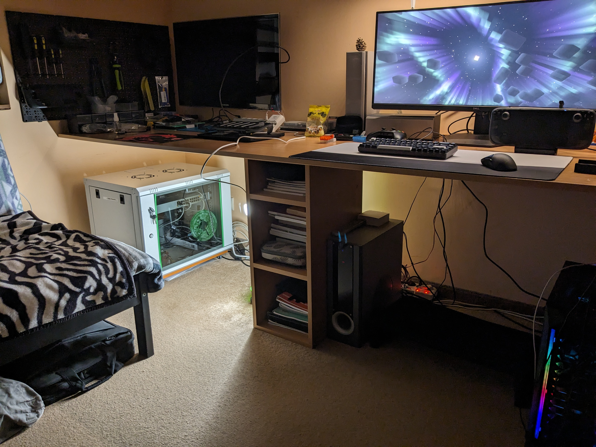

# HomeLab
## Welcome
Welcome to my HomeLab! (v1)  
Feel free to browse the images related to each device / setup in the repository!  
Below you can find a list of each important part of my homelab / tech I use and other things I'm currently working on:
## 
## [ThinkRack](markdown/ThinkRack_Setup.md):
- ### [Lenovo M720Q MiniPC Setup](markdown/Lenovo_M720Q_Setup.md)
- ### [Proxmox Setup](markdown/Proxmox_Setup.md)
- ### [Storage Setup](markdown/Storage_Setup.md)
## Devices:
- ### [Lenovo ThinkPad T480s](markdown/Lenovo_ThinkPad_T480s_Setup.md)
- ### [PC Setup](markdown/PC_Setup.md)
- ### [Steam Deck](markdown/Steam_Deck_Setup.md)
## Other:
- ### [3D Model Links](markdown/3D_Model_Links.md)
## Current Events / TODO List (bold items are in progress): 
### This repository
- Probably rebrand/rename this repository in the future as it's now more general tech things I do
- Add a markdown file linking to guides I made or copy them over to here
### Steam Deck
- Make post about average r/SteamDeck_2 user (compilation of previous polls' results)
- Undervolting or overclocking the Steam Deck? (post to r/SteamDeck_2)
- **Add some of C418's music to the Steam Deck "Decky" Audio Loader plugin? [Decky_Audio_Packs Repository WIP](https://github.com/NKkrisz/Decky_Audio_Packs)**
### Server
- Try setting up SyncThing on all devices (laptop, desktop, Steam Deck, phone)
- **Make backups of important things to server**
- Upgrade minipc RAM and main drive
- Add new storage setup details
- Setup Virtual Machines
- Remove bad drive/s
- Setup Immich
- Try Docker
- Setup VPN
### Main PC / Laptop / Phone
- Maybe try Fedora KDE again on main PC and perhaps laptop too (may wait until Fedora 40, but first I have to review the headphones)
- Upgrade laptop screen and make a portable monitor out of the old one
- Maybe try installing a custom ROM to my old tablet (and phone too?)
- Upgrade main PC to 32GB RAM, better CPU and GPU
- Reset VSCode, Firefox and my phone
- Upgrade laptop storage and RAM
### Audio Gear
- **Get a portable DAC & AMP combo (Fiio KA13 acquired, ordered a leather case for it)**
- **Perhaps look into IEMs (currently thinking about the SIMGOT EW200)**
- **Replace Sennheiser HD580's cables (4.4mm balanced, ordered)**
### Photography Gear
- Google Pixel 6a for most "everyday" photos
- Canon EOS 1200D (DSLR) for more detailed shots
### Upcoming Reviews
- **Sennheiser HD580 Precision Headphones and compare to Superlux HD681B (restart writing it)**
- Maybe category: ThinkPad T480s, Sony LinkBuds S, Pixel 6a, Steam Deck
- **Nullmini ear/head paddings that I've got for the HD580**
- Add images of each item to this repository
### Other Repositories / Ideas
- Xbox Series X Controller Front Plate Swap + Maybe try replacing one of the potentiometers
- Update VanillaQOL Minecraft (Modrinth) modpack once Iris supports Distant Horizons
- Make a blog where I can post my original content and compile cool things I've done
- Make a "life progress tracker" website (current things: fitness, book reading)
- **Apple Macintosh PowerBook 190 (pictures and perhaps video soon)**
- TryHackMe, HackTheBox etc... (Research/learn cybersecurity?)
- Make a mix of C418's music (try out Reaper/LMMS)
- Remake my portfolio site (halfway done)
- Make a repository for cybersecurity stuff
- Start making things for Project_Restart
- Make a list of software I like using
- Want To Try VR Gaming/Apps