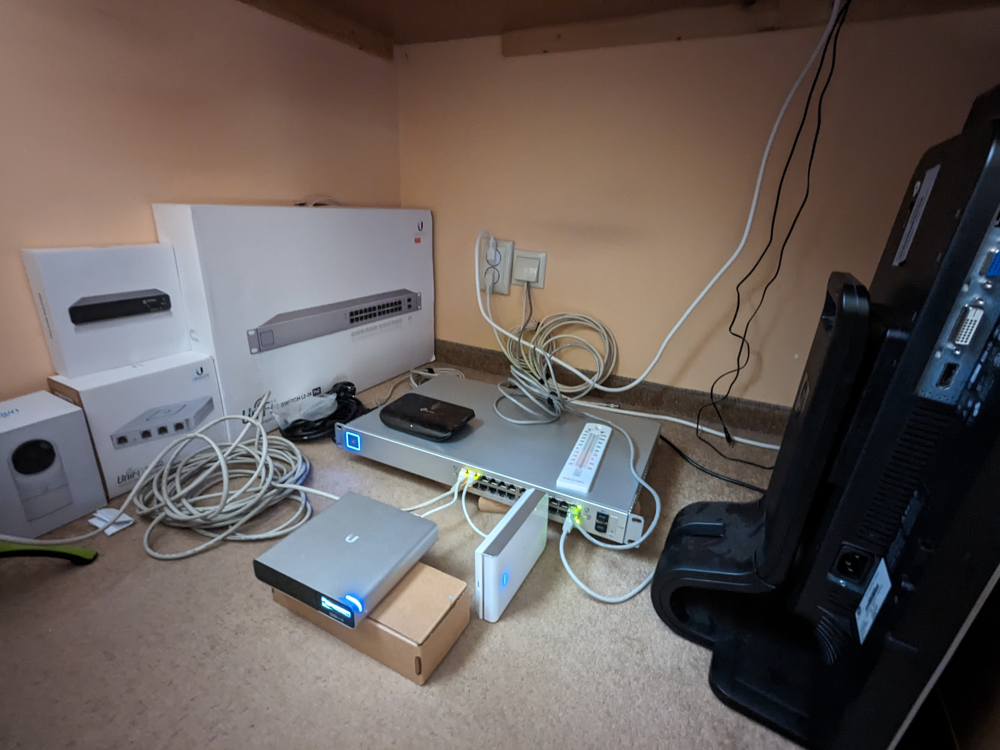
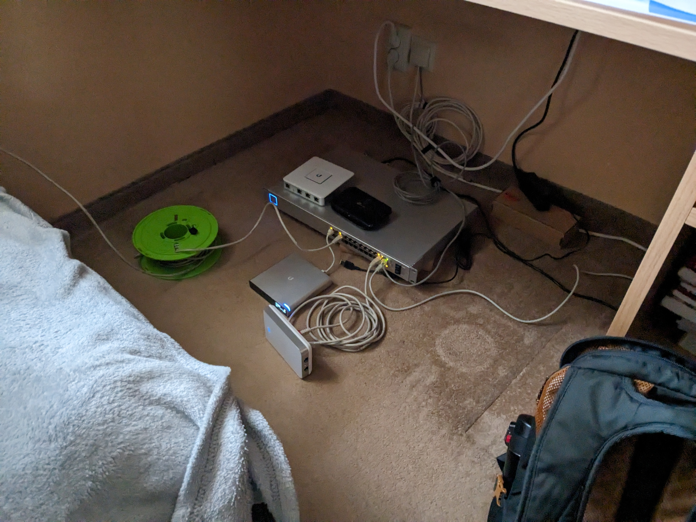

# History

## The Beginning (~2021 - 2022)

I started with a simple Dell Latitude E6410 which is a very low powered (Intel i5 560m and 2-4GB of RAM) laptop.  
My first "homelab" project was getting Plex running on it which I was successful with.  
It was I think my first attempt at running and "remotely" managing a Linux server using SSH.  
If I remember correctly it was an Ubuntu Server but really it was only accessible on our home network.  
I also managed to make a somewhat working Samba share so it's easier to share the content for later access through Plex.  
The machine was running under our TV so it could get power there while also getting a stronger WiFi signal (it was closer to our router this way).  
Here is what one of those laptops looks like (I got 6 in total for free from one of my family members):

## Getting Some Proper Networking Gear (Summer 2023)

After seeing a Reddit post about someone wanting to give away free Ubiquiti stuff I messaged the poster and I got lucky.  
The only requirement is that once I don't use it I have to give it forward for free again.  
This is when I started learning a bit more about networks and how the initial setup works.  
I didn't use the USG router for some time because I couldn't get it to be adopted into my Ubiquiti network (which I later figured out was caused by using the old manual / router settings page instead of setting it up in the Ubiquiti network page).  
I also didn't have a rack yet so I had the switch propped on top of some wooden scraps found in our garage.  
Here is how it looked like (pretty janky cabling, I know):

After a bit of cleaning up:
