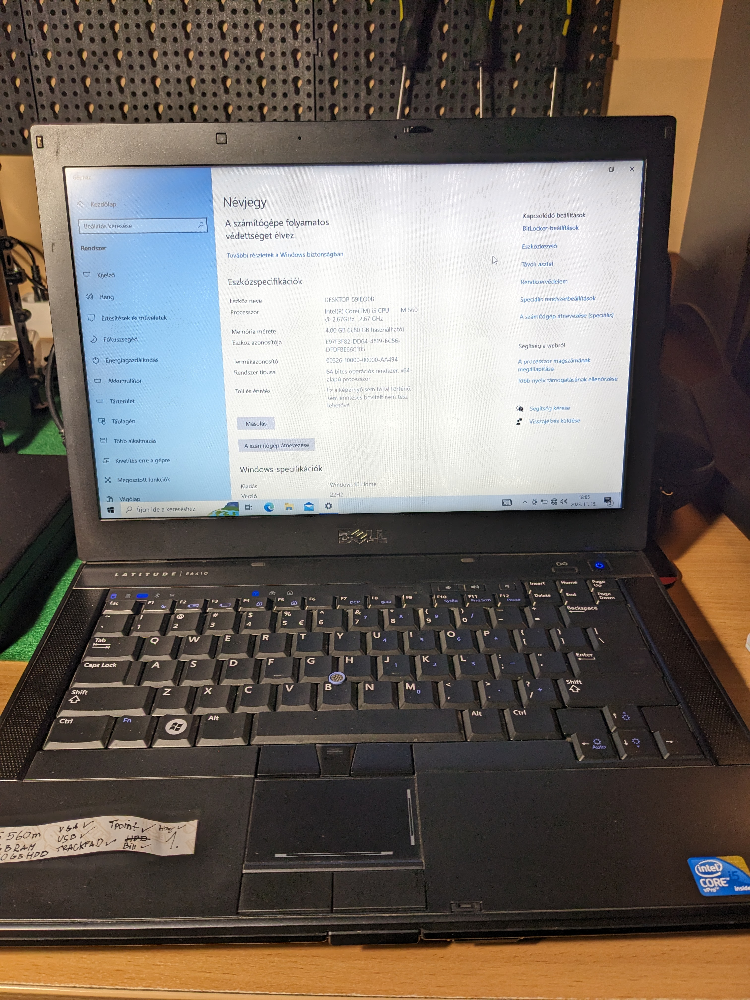

# History

## The Beginning

I started with a simple Dell Latitude E6410 which is a very low powered (Intel i5 560m and 2-4GB of RAM) laptop.  
My first "homelab" project was getting Plex running on it which I was successful with.  
It was I think my first attempt at running and "remotely" managing a Linux server using SSH.  
If I remember correctly it was an Ubuntu Server but really it was only accessible on our home network.  
I also managed to make a somewhat working Samba share so it's easier to share the content for later access through Plex.  
The machine was running under our TV so it could get power there while also getting a stronger WiFi signal (it was closer to our router this way).  
Here is what one of those laptops looks like (I got 6 in total for free from one of my family members):
