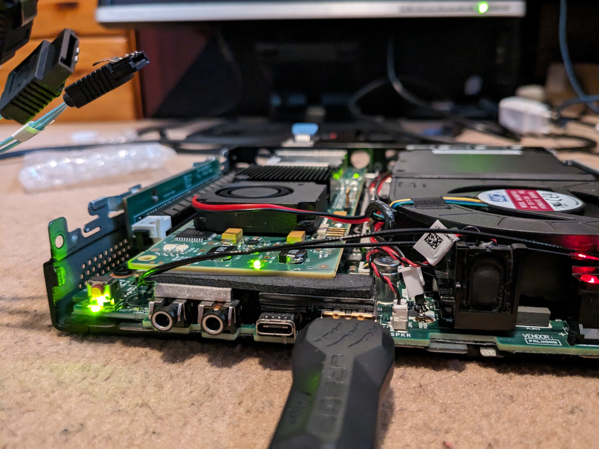

# Lenovo M720Q MiniPC Setup

- CPU: [Intel i5 8500T (6c/6t)](https://www.intel.com/content/www/us/en/products/sku/129941/intel-core-i58500t-processor-9m-cache-up-to-3-50-ghz/specifications.html)
- RAM: Ramaxel & Lenovo 2x8GB DDR4 @ 2666MT/s
- Boot drive: [WD SN530 256GB NVMe M.2 2280 SSD](https://www.westerndigital.com/en-ap/products/internal-drives/pc-sn530-ssd)
- PCI-e adapter: 01AJ940
- HBA: [LSI 9200-8e in IT Mode](https://docs.broadcom.com/doc/12353324)
- Extra cooling: USB powered [Noctua NF-A4X20 PWM](https://noctua.at/en/nf-a4x20-pwm) in front
- 12V 40x40x10mm Radial Fan for HBA connected to the board
- [3D Printed Back Cover For HBA](https://www.printables.com/model/701086-lsi-9200-8e-pci-eback-cover-for-lenovo-m720q)
- [Connected Storage Setup](./Storage_Setup.md)