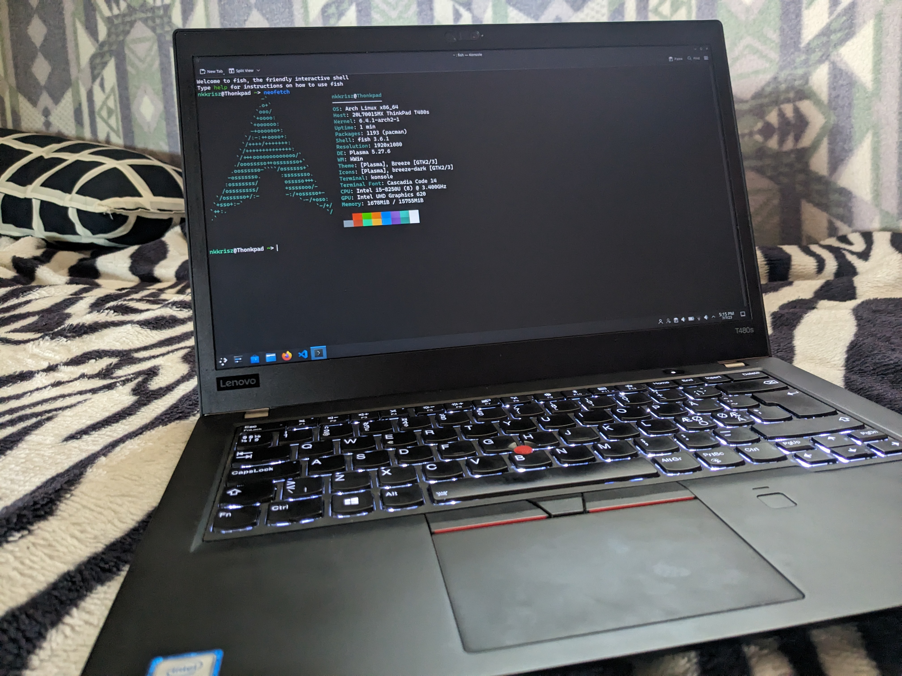

# Lenovo ThinkPad T480s

## Why Choose A ThinkPad?
- Durable and repairable (maybe even upgradeable!)
- Great keyboard and trackpoint is useful sometimes
- Can be found on the used market for a good price (avoid low resolution panels though)
- Great community on [r/ThinkPad](https://www.reddit.com/r/thinkpad/) in case you have some questions or ideas
- Just looks good in my opinion, I even carbon fiber wrapped mine
- Works okay with Linux (fingerprint reader on some models like mine can have some issues)
- Great port selection (at least on my T480s)

## Main Components:
- CPU: [Intel (R) Core(TM) i5-8250U CPU @ 1.60Ghz]()
- iGPU Model: [Intel Corporation UHD Graphics 620 (rev 07)]()
- RAM: [2x8GB]()

## Storage:
- Main Drive: [Samsung PM961 256GB NVMe M.2 SSD]()

## Display:
- Main: [1080p IPS]()

## Networking:
- Wireless: Intel Corporation Wi-Fi 6 AX210/AX211/AX411 160Mhz (rev 1a)
- Wired: Intel Corporation Ethernet Connection (4) I219-V

## Other:
- Chipset Model: Lenovo ThinkPad T480s 20L7001SMX
- Keyboard: AT Translated Set 2 Keyboard
- Trackpad: Elan Touchpad
- Trackpoint: Elan Trackpoint
- Audio Codec: (HDA Intel PCH) ALC257 Analog
- Current Operating System: Windows 11 Pro
- 1440p screen swap in future?