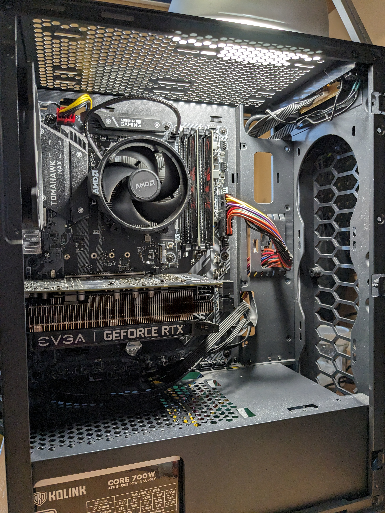

# PC Setup

(This was before I added additional fans and SSD)

## Main Components:
- CPU: [AMD Ryzen 3 3100 (4c/8t)](https://www.amd.com/en/support/cpu/amd-ryzen-processors/amd-ryzen-3-desktop-processors/amd-ryzen-3-3100)
- Motherboard: [MSI B450 Tomahawk Max](https://www.msi.com/Motherboard/B450-TOMAHAWK-MAX)
- RAM: [G.Skill Aegis 2x8GB DDR4 @ 3200MT/s](https://www.gskill.com/product/165/185/1567584549/F4-3200C16D-16GIS)
- GPU: [EVGA RTX 2060 SC (Overclocked with MSI Afterburner)](https://www.evga.com/products/specs/gpu.aspx?pn=938419ed-6e79-4259-b3c7-3deb3e869493)
- PSU: [Kolink Core 700W 80 Plus](https://kolink.eu/Home/psu-1/core-series/kolink-core-psu---700w---80-plus.html)

## Storage:
- Boot Drive: [Samsung 970 EVO Plus 1TB NVMe M.2 2280 SSD](https://semiconductor.samsung.com/consumer-storage/internal-ssd/970evoplus/)
- HDD #1: [Seagate BarraCuda 2TB 7200rpm 256MB HDD](https://www.seagate.com/gb/en/products/hard-drives/barracuda-hard-drive/)

## Case And Cooling:
- Case: [Cougar MX410](https://cougargaming.com/products/cases/mx410/)
- Fans: 
    - RGB Fan from case (in the back)
    - 5x [Artic P12 Max (3x in front, 2x on top)](https://www.arctic.de/en/P12-Max/ACFAN00280A)
- CPU Cooler: [AMD Wraith Stealth (Stock Cooler)](https://www.amd.com/en/technologies/cpu-cooler-solution)
- Thermal Paste: Some random one I found in the house

## Audio Setup:
- Headphones: [Sennheiser HD580 Precision](https://www.head-fi.org/threads/hello-everyone-yesterday-i-entered-the-midrange-with-my-new-hd580-but-i-have-some-questions.971605/), Superlux HD681B
- Speakers: Orion HT728 5.1 Speaker Set With Remote
- Wireless Earbuds: [Sony LinkBuds S](https://electronics.sony.com/audio/headphones/truly-wireless-earbuds/p/wfls900n-b)

## Display Setup:
- Main: [Dell S3422DWG (Curved Ultrawide, WQHD, 144Hz, VA, HDR400, AMD Freesync)](https://www.dell.com/en-us/shop/dell-34-curved-gaming-monitor-s3422dwg/apd/210-azep/monitors-monitor-accessories)

## Input Devices:
- Mouse: [Delux M800DB(PMW3335)](https://www.deluxworld.com/en-pro-detail-m800db-3335.html)
- Keyboard: "Black n White" (Custom made 75%, 2.4Ghz and Bluetooth, 2x AAA 200mA battery powered)
    - Keycaps: [GMK WoB Clone](https://drop.com/buy/gmk-white-on-black-custom-keycap-set)
    - Switches: [Akko V3 Cream Yellow](https://en.akkogear.com/product/akko-v3-cream-yellow-switch-45pcs/)
    - Board and Case: [Tester68 (Translucent Black)](https://imgur.com/a/T1dikC4#mkKwVu0)
    - Lube: Krytox 205g0
    - Mods:
        - Lubed switches and stabs
        - Holee modded stabs
        - Taped bottom of board
        - Foam added
- Controller: [Xbox Series X with USB-C Cable](https://www.xbox.com/en-US/accessories/controllers/xbox-wireless-controller-usb-c)
- Microphone: [Hama uRage Stream 100 USB](https://uk.hama.com/00186017/urage-stream-100-gaming-microphone)
- Mouse Mat: AliExpress Custom 400x800x3mm

## Other:
- Current Operating System: Windows 11 Pro
- Bluetooth adapter: [ASUS USB-BT500](https://www.asus.com/networking-iot-servers/adapters/all-series/usb-bt500/)
- Printer: [HP Laserjet 1018](https://support.hp.com/us-en/product/details/hp-laserjet-1018-printer/1814092)