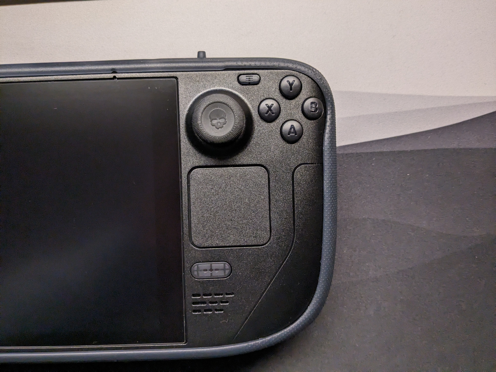
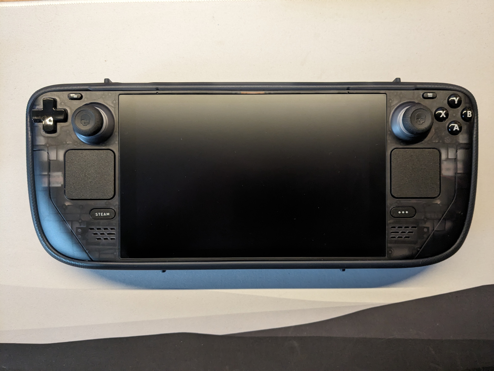

# Steam Deck

## Why I Chose The Steam Deck:
- Most affordable x64 gaming handheld
    - I've been a PC only gamer ever since I was a little kid
- Powerful enough for my games (mostly play indies)
    - Though battery is sometimes lacking for more demanding games which is fixed on the OLED Deck
- Wide variety of input options (especially the trackpads)
    - Very useful if you can tinker with Steam Input and while using Desktop Mode
- Open operating system (runs SteamOS which is Linux under the hood)
    - Want to support Linux hardware and want to see it's market share rise
- Easily repairable or moddable (see below)
    - Parts being readily available on iFixit is just great
- Great community and manufacturer who I want to support
    - [Come to r/SteamDeck_2!](https://www.reddit.com/r/SteamDeck_2)
- Already owned games on Steam, still can use other launchers if needed
    - Also emulating on this device is awesome using EmuDeck but I don't do that

## Current Setup

Previous Deck got RMA'd by Valve even though I shell swapped it and was out of warranty (2022 October).  
I lost my transparent front plate because of this (couldn't swap the original back), but I would rather have a working Deck than a bricked Deck.  
Now that the new one arrived (3rd) I also modified it.  
I get to reuse the backplate and I also swapped the buttons this time which look pretty pretty cool. Also swapped back from 64GB to the 256GB SSD I upgraded to in the previous one.  
Thanks Valve :)  
Stuff changed: Switched to Somfoon Glossy Screen Protector, [see comparison here](https://www.reddit.com/r/SteamDeck_2/comments/1bbhsdg/antiglare_glossy_screen_protectors_comparison/)

## Old Setup

[(Old setup, this one broke and was unable to boot, luckily Valve gave me a new one)](https://www.reddit.com/r/SteamDeck/comments/19aklxn/cant_get_my_deck_to_boot_or_display_anything/)
- ExtremeRate Black Transparent Shell 
- Mepatem Case 
- Original Buttons
- Skull&Co Thumbstick and Back Button Grips. 
- Rubber Rings on thumbsticks so it's a bit quieter. 
- Swapped from 64GB to 256GB Samsung PM991a SSD. 
- Somfoon Antiglare Screen Protector (it makes the image less colorful and sharp but it's anti glare is really good and extra protection is nice).

## The process

The shell swap took a whole day and a bit more, scariest part was getting the screen out. Had to use some of the original screws instead of what was given by ExtremeRate (maybe I swapped some, the tutorial isn't very clear about which screws to use as the pictures don't really show the length of them). Used a hair dryer and the metal + some of my own plastic tools to pry up the screen. Make sure to not go deep on the right edge because that's where the screen's cables are. Getting the glue off was a bit tedious too but it's possible as you can see.