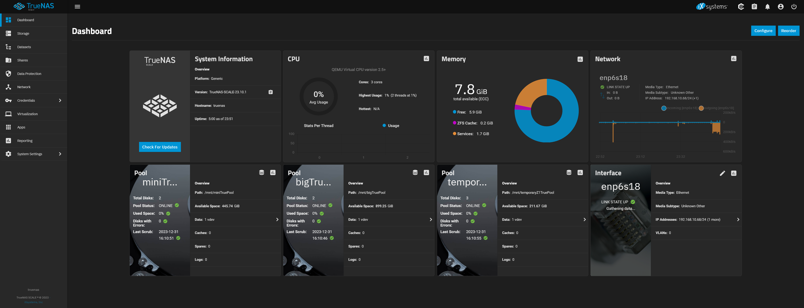

# TrueNAS Scale running in Proxmox VM with HBA in PCI-e passthrough
**OUT OF DATE**

## Hardware:
- Lenovo M720Q MiniPC
- CPU: 3 cores
- RAM: 8GB
- TrueNAS Storage: 50GB
- HBA: LSI 9200-8e
- PCI-e adapter: 01AJ940

## Pools:
- miniTruePool - MIRROR
- bigTruePool - MIRROR
- temporaryZ1TruePool - RAIDZ1

## Disks (Old, to be updated soon):
|  Name |   Disk Size  |          Pool         | Disk Type |           Model           |
|:-----:|:------------:|:---------------------:|:---------:|:-------------------------:|
|  sda  |  50 GiB      |  boot-pool            |    HDD    |  QEMU_HARDDISK            |
|  sdb  |  465.76 GiB  |  miniTruePool         |    HDD    |  Hitachi_HDP725050GLA360  |
|~~sdc~~|~~298.09 GiB~~|~~temporaryZ1TruePool~~|~~~~HDD~~~~|~~ST9320325AS~~            |
|  sdd  |  465.76 GiB  |  miniTruePool         |    HDD    |  Hitachi_HDP725050GLA360  |
|~~sde~~|~~111.79 GiB~~|~~temporaryZ1TruePool~~|~~~~SSD~~~~|~~KINGSTON_SV300S37A120G~~ |
|  sdf  |  931.51 GiB  |  bigTruePool          |    HDD    |  SAMSUNG_HD103SJ          |
|  sdg  |  931.51 GiB  |  bigTruePool          |    HDD    |  WDC_WD10EZEX-00RKKA0     |
|~~sdh~~|~~223.57 GiB~~|~~temporaryZ1TruePool~~|~~~~SSD~~~~|~~CT240BX500SSD1~~         |

## Powered by:

- Old ATX 250W PSU (probably taken out of an old PC from the garage)
- 2x Molex to 5x SATA Power Connections (2x 2.5", 2x 3.5" and an Arctic P12 PWM PST fan on each)
- 24 pin jumper/switch adapter with a red LED