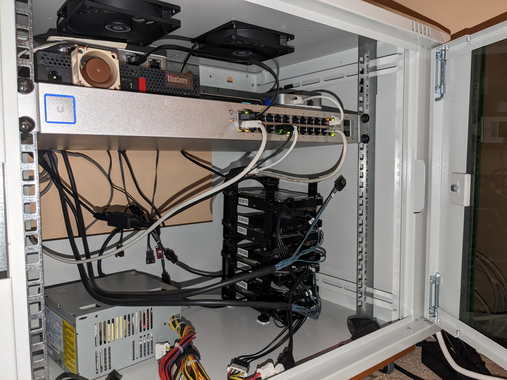
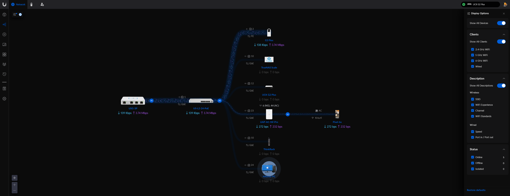

# ThinkRack

## Why Make This?
- I got free networking gear from a very nice person (basically all Ubiquiti stuff here)
- I've been interested in self hosting before building this
    - I hosted Plex on an old Dell laptop as my first homelab-esque project
- I wanted to learn new things related to networking and operating more complex systems
    - Virtual machines (Proxmox), Docker (SoonTM), General Linux knowledge etc...
- I need more storage / backups for my files and media
- I like doing cool things with hardware
    - Getting the Lenovo MiniPC to work as a NAS with a HBA and replacing fans on a network switch is really *cool* in my opinion
- I've got inspired by:
    - [r/Homelab](https://www.reddit.com/r/homelab/)
    - [Jeff Geerling](https://www.youtube.com/@JeffGeerling)
    - [Linus Tech Tips](https://www.youtube.com/@LinusTechTips)

## Hardware
- Rack: Digitus DN-19 09-U-EC
- Ubiquiti Networking:
    - Router: USG-3P
    - Cloud Key: UCK-G2-Plus
    - Access Point: UAP-AC-IW-Pro
    - Switch: US-L2-24-PoE (2x Noctua NF-A4X20 PWM fan replacement)
    - Camera: G3-Flex
- Lenovo M720Q MiniPC (Running Proxmox -> TrueNAS Scale, 1x Noctua NF-A4X20 PWM fan powered with USB placed to front)
- 3D Printed 8x 3.5" Drive Rack with 3D printed 2.5" to 3.5" drive holders (5 HDD, 2 SSD)
- 250W ATX PSU with adapters
- Cooling: 2x Arctic P12 PWM PST fans
- Wired network: GbE
- Wireless network: WiFi 5